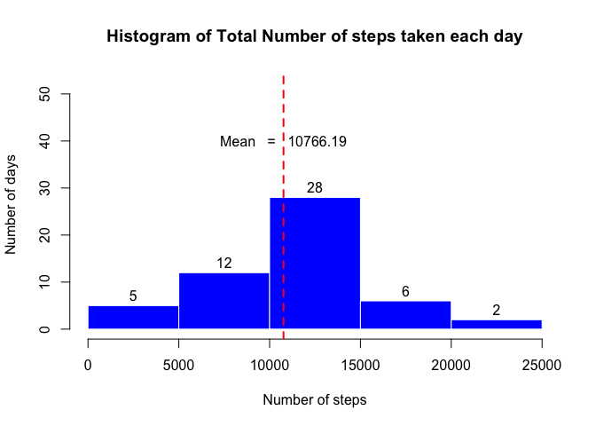
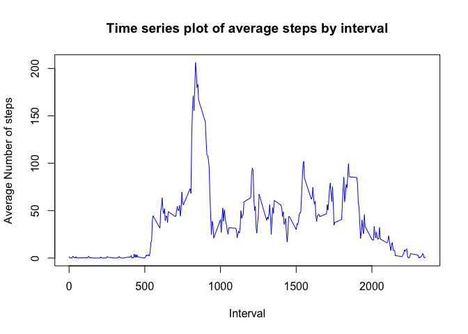
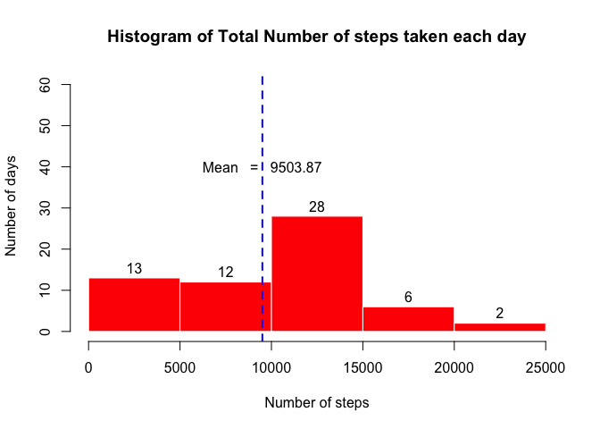
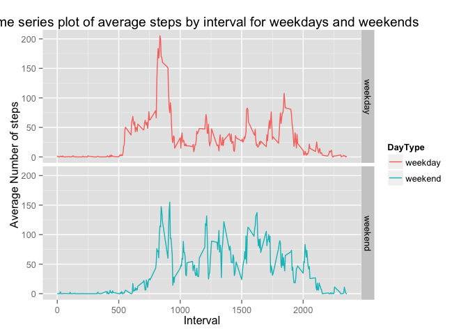

# Reproducible Research - Peer Assessment 1

## Background
* It is now possible to collect a large amount of data about personal movement using activity monitoring devices such as a Fitbit, Nike Fuelband, or Jawbone Up.  
* These type of devices are part of the “quantified self” movement – a group of enthusiasts who take measurements about themselves regularly to improve their health,  
to find patterns in their behavior, or because they are tech geeks.  
* The data remain under-utilized both because the raw data are hard to obtain and there is a lack of statistical methods and software for processing and interpreting the data.

## Data used for this assignment 
* This assignment makes use of data from a personal activity monitoring device.  
* This device collects data at 5 minute intervals through out the day.  
* The data consists of two months of data from an anonymous individual collected during the months of October and November, 2012 and include the number of steps taken in 5 minute intervals each day.

## Data
### Source
* The github repo RepData_PeerAssessment1 containing the dataset was forked and cloned into my local computer

### Data Structure and Variables
* The following code chunk unzips the data and reads the csv file containing the dataset and generates summary statistic on the dataset
* The dataset is stored in a comma-separated-value (CSV) file and there are a total of 17,568 observations in this dataset.
* The variables included in this dataset are:    
        1. steps: Number of steps taking in a 5-minute interval (missing values are coded as NA)  
        2. date: The date on which the measurement was taken in YYYY-MM-DD format  
        3. interval: Identifier for the 5-minute interval in which measurement was take  


```r
unzip("activity.zip")
Activity <- read.csv("activity.csv")
Activity$date <- as.Date(Activity$date)
str(Activity)
```

```
## 'data.frame':	17568 obs. of  3 variables:
##  $ steps   : int  NA NA NA NA NA NA NA NA NA NA ...
##  $ date    : Date, format: "2012-10-01" "2012-10-01" ...
##  $ interval: int  0 5 10 15 20 25 30 35 40 45 ...
```

## Exploratory Analysis 
### Total number of steps taken per day
* The following code chunk calculates and prints the total number of steps taken per day
* Missing values are ignored for the purposes of this computation


```r
library(dplyr)
```

```
## 
## Attaching package: 'dplyr'
## 
## The following objects are masked from 'package:stats':
## 
##     filter, lag
## 
## The following objects are masked from 'package:base':
## 
##     intersect, setdiff, setequal, union
```

```r
TotAct <- Activity %>%
        filter(steps != 'NA') %>%
        group_by(date) %>%
        summarise(TotSteps=sum(steps))
xtabs(TotSteps~date,data=TotAct)
```

```
## date
## 2012-10-02 2012-10-03 2012-10-04 2012-10-05 2012-10-06 2012-10-07 
##        126      11352      12116      13294      15420      11015 
## 2012-10-09 2012-10-10 2012-10-11 2012-10-12 2012-10-13 2012-10-14 
##      12811       9900      10304      17382      12426      15098 
## 2012-10-15 2012-10-16 2012-10-17 2012-10-18 2012-10-19 2012-10-20 
##      10139      15084      13452      10056      11829      10395 
## 2012-10-21 2012-10-22 2012-10-23 2012-10-24 2012-10-25 2012-10-26 
##       8821      13460       8918       8355       2492       6778 
## 2012-10-27 2012-10-28 2012-10-29 2012-10-30 2012-10-31 2012-11-02 
##      10119      11458       5018       9819      15414      10600 
## 2012-11-03 2012-11-05 2012-11-06 2012-11-07 2012-11-08 2012-11-11 
##      10571      10439       8334      12883       3219      12608 
## 2012-11-12 2012-11-13 2012-11-15 2012-11-16 2012-11-17 2012-11-18 
##      10765       7336         41       5441      14339      15110 
## 2012-11-19 2012-11-20 2012-11-21 2012-11-22 2012-11-23 2012-11-24 
##       8841       4472      12787      20427      21194      14478 
## 2012-11-25 2012-11-26 2012-11-27 2012-11-28 2012-11-29 
##      11834      11162      13646      10183       7047
```

### Histogram of the total number of steps taken each day
* The following code chunk creates a hisotgram of total number of steps taken per day 
* On most days, the total number of steps taken was between 10000 and 15000 


```r
hist(TotAct$TotSteps,col="blue",border="white",labels=TRUE, main="Histogram of Total Number of steps taken each day",xlab="Number of steps",ylab="Number of days",ylim=c(0, nrow(TotAct)))
abline(v=mean(TotAct$TotSteps),col="red",lwd=2, lty=2)
text(mean(TotAct$TotSteps),40,paste("Mean"," ","="," ", round(mean(TotAct$TotSteps),2)))
```

 


### Mean and Median of the total number of steps taken per day
* The following code chunk calculates the mean and median of the total number of steps taken each day
* The mean and median values are close but are not exactly equal
* The mean is 10766 and median is 10765

```r
library(dplyr)
AvgAct <- TotAct %>%
        summarise(MeanSteps=round(mean(TotSteps),0),MedianSteps=round(median(TotSteps))) %>%
        print 
```

```
## Source: local data frame [1 x 2]
## 
##   MeanSteps MedianSteps
## 1     10766       10765
```

### Average daily activity pattern
* The following code chunk creates a dataset containing average number of steps by interval across all days
* A time series plot of interval on x-axis and average number of steps on y-axis is created 
* Missing values are removed 
* The vertical line on the plot indicates the 5 - minute interval with the maximum average number of steps

```r
library(dplyr)
IntAct <- Activity %>%
filter(steps != 'NA') %>%
group_by(interval) %>%
summarise(AvgSteps=mean(steps))
plot(IntAct$interval,IntAct$AvgSteps,type="l",col="blue",main="Time series plot of average steps by interval",xlab="Interval",ylab="Average Number of steps")
```

 

* The following code chunk identifies the 5 minute interval that contains the maximum number of steps 
* The 5 - minute interval 835 has the maximum average number of steps of 206.17 across all days 

```r
library(dplyr)
IntAct1 <- IntAct %>%
        filter(AvgSteps == max(AvgSteps)) %>%
        print
```

```
## Source: local data frame [1 x 2]
## 
##   interval AvgSteps
## 1      835 206.1698
```

## Missing Value treatment 
### Total number of missing values in the dataset 
* The following code chunk creates a vector of missing values and then subsets the main dataset to create a dataframe containg just missing values
* There are 2304 missing values in the dataset

```r
bad <- is.na(Activity)
missing <- Activity[bad,]
nrow(missing)
```

```
## [1] 2304
```
### Imputing missing values
* The following code chunk creates a new dataset Activity_New by imputing the missing values in the original dataset
* Each missing value is imputed by the median number of steps of the corresponding 5-minute interval across all days
* Activity_New also has 17568 observations 

```r
library(dplyr)
ImputeVal <- Activity %>%
filter(steps != 'NA') %>%
group_by(interval) %>% 
summarise(MedianVal=median(steps))

missing1 <- missing %>%
left_join(ImputeVal,by="interval") %>%
select(MedianVal,date,interval) %>%
rename(steps=MedianVal)

good <- complete.cases(Activity)
nonmissing <- Activity[good,]

Activity_New <- rbind(nonmissing,missing1)

Activity_New <- Activity_New[order(Activity_New$date,Activity_New$interval),]
str(Activity_New)
```

```
## 'data.frame':	17568 obs. of  3 variables:
##  $ steps   : int  0 0 0 0 0 0 0 0 0 0 ...
##  $ date    : Date, format: "2012-10-01" "2012-10-01" ...
##  $ interval: int  0 5 10 15 20 25 30 35 40 45 ...
```

### Impact of imputing
* The code chunk below calculates the total number of steps for each day using the new dataset with imputed missing values

```r
library(dplyr)
TotAct_New <- Activity_New %>%
        group_by(date) %>%
        summarise(TotSteps=sum(steps))
xtabs(TotSteps~date,data=TotAct_New)
```

```
## date
## 2012-10-01 2012-10-02 2012-10-03 2012-10-04 2012-10-05 2012-10-06 
##       1141        126      11352      12116      13294      15420 
## 2012-10-07 2012-10-08 2012-10-09 2012-10-10 2012-10-11 2012-10-12 
##      11015       1141      12811       9900      10304      17382 
## 2012-10-13 2012-10-14 2012-10-15 2012-10-16 2012-10-17 2012-10-18 
##      12426      15098      10139      15084      13452      10056 
## 2012-10-19 2012-10-20 2012-10-21 2012-10-22 2012-10-23 2012-10-24 
##      11829      10395       8821      13460       8918       8355 
## 2012-10-25 2012-10-26 2012-10-27 2012-10-28 2012-10-29 2012-10-30 
##       2492       6778      10119      11458       5018       9819 
## 2012-10-31 2012-11-01 2012-11-02 2012-11-03 2012-11-04 2012-11-05 
##      15414       1141      10600      10571       1141      10439 
## 2012-11-06 2012-11-07 2012-11-08 2012-11-09 2012-11-10 2012-11-11 
##       8334      12883       3219       1141       1141      12608 
## 2012-11-12 2012-11-13 2012-11-14 2012-11-15 2012-11-16 2012-11-17 
##      10765       7336       1141         41       5441      14339 
## 2012-11-18 2012-11-19 2012-11-20 2012-11-21 2012-11-22 2012-11-23 
##      15110       8841       4472      12787      20427      21194 
## 2012-11-24 2012-11-25 2012-11-26 2012-11-27 2012-11-28 2012-11-29 
##      14478      11834      11162      13646      10183       7047 
## 2012-11-30 
##       1141
```
* The code chunk below creates a histogram of total number of steps taken each day
* The vertical line indicates the mean of the total number of steps taken each day 
* The mean has shifted to the left as a result of imputing the missing values

```r
hist(TotAct_New$TotSteps,col="red",border="white",labels=TRUE, main="Histogram of Total Number of steps taken each day",xlab="Number of steps",ylab="Number of days",ylim=c(0, nrow(TotAct_New)))
abline(v=mean(TotAct_New$TotSteps),col="blue",lwd=2, lty=2)
text(mean(TotAct_New$TotSteps),40,paste("Mean"," ","="," ", round(mean(TotAct_New$TotSteps),2)))
```

 

* The code chunk below calculates the mean and median of the total number of steps taken each day on the new dataset with imputed missing values 
* The mean has changed signticantly and is 9504 while the median has been impacted slightly and is now at 10395

```r
library(dplyr)
AvgAct_New <- TotAct_New %>%
        summarise(MeanSteps_New=round(mean(TotSteps),0),MedianSteps_New=round(median(TotSteps))) %>%
        print 
```

```
## Source: local data frame [1 x 2]
## 
##   MeanSteps_New MedianSteps_New
## 1          9504           10395
```
* The following code chunk compares the mean and median calculated from the original dataset and imputed dataset 
* The mean of total number of steps calculated based on the imputed dataset is 12% lower compared to what was calculated based on the original dataset 
* The median of total number of steps calculated based on the imputed dataset is 3% lower compared to what was calculated based on the orignal dataset

```r
Stats_Compare <- cbind(AvgAct,AvgAct_New)
Stats_Compare <- Stats_Compare %>%
        summarise(Mean_pctdiff =(((MeanSteps_New-MeanSteps)/MeanSteps)*100), Median_pctdiff=(((MedianSteps_New-MedianSteps)/MedianSteps)*100))%>%
        select(Mean_pctdiff,Median_pctdiff) %>%
        print
```

```
##   Mean_pctdiff Median_pctdiff
## 1    -11.72209      -3.437065
```

### Are there differences in activity patterns between weekdays and weekends?

* The dataset Activity_New with imputed values is used
* The following code chunk creates a new factor variable in the dataset with two levels – “weekday” and “weekend” indicating whether a given date is a weekday or weekend day

```r
Activity_New$Day <- weekdays(Activity_New$date,abbreviate=FALSE)
for (i in 1:nrow(Activity_New)) {if(Activity_New$Day[i] == 'Saturday') {Activity_New$DayType[i]="weekend"} else if(Activity_New$Day[i]=='Sunday') {Activity_New$DayType[i]="weekend"} else{Activity_New$DayType[i]="weekday"}}
Activity_New$DayType <- as.factor(Activity_New$DayType)
str(Activity_New)
```

```
## 'data.frame':	17568 obs. of  5 variables:
##  $ steps   : int  0 0 0 0 0 0 0 0 0 0 ...
##  $ date    : Date, format: "2012-10-01" "2012-10-01" ...
##  $ interval: int  0 5 10 15 20 25 30 35 40 45 ...
##  $ Day     : chr  "Monday" "Monday" "Monday" "Monday" ...
##  $ DayType : Factor w/ 2 levels "weekday","weekend": 1 1 1 1 1 1 1 1 1 1 ...
```

* The following code chunk first creates a dataset containing the average number of steps taken each day by weekday and weekend 
* Based on the dataset above, it creates a panel plot containing a time series plot of the 5-minute interval (x-axis) and the average number of steps taken, averaged across all weekday days or weekend days
* Weekday has a higher variability in the number of steps compared to weekends

```r
Activity_New_DayType <- Activity_New %>%
group_by(DayType, interval) %>%
summarise(AverageSteps=mean(steps))

library(ggplot2)
g <- ggplot(Activity_New_DayType,aes(interval,AverageSteps))
g+geom_line(aes(color=DayType))+facet_grid(DayType~.)+labs(title="Time series plot of average steps by interval for weekdays and weekends",x="Interval",y="Average Number of steps")
```

 


